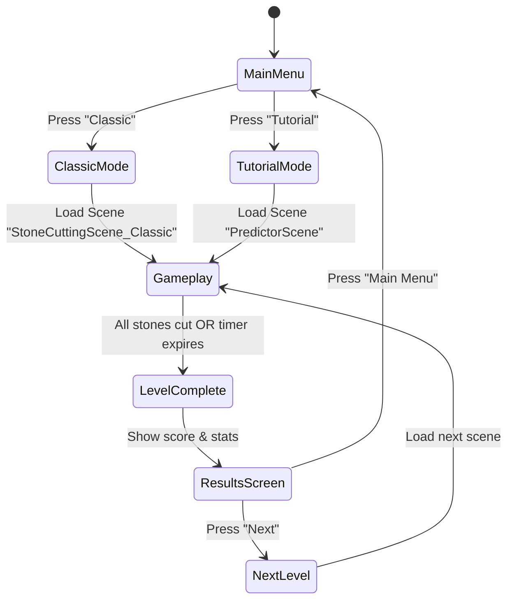

# Game Flow GDD – Hands of the Mystical Saw

## 1. Overview
The game is divided into distinct *states* that the player moves through via UI interactions and in‑game actions. The primary loop is:

1. **Main Menu** → select *Mode* (Classic, Tutorial, Settings).
2. **Level Load** → initialize scene, spawn stone(s) and tools.
3. **Gameplay** → player aims, slices, gains score, and progresses.
4. **Level End** → evaluate performance, show results, unlock next level.
5. **Return to Main Menu** or **Progression** to the next scene.

All transitions are driven by Unity’s `SceneManager.LoadScene` and a small **GameStateManager** script (to be added).

---
## 2. State Diagram


---
## 3. Detailed Flow per Scene
### 3.1 MainMenu.unity
- **UI Elements**: Buttons (Classic, Tutorial, Settings), Title Text, Background.
- **Scripts**:
  - `VirtualJoystick.cs` – not used here but loaded for consistency.
  - `AnchorBlinker.cs` – animates button highlights.
- **Transitions**:
  - On button click, call `SceneManager.LoadScene("StoneCuttingScene_Classic")` or `..."PredictorScene"`.

### 3.2 StoneCuttingScene_Classic.unity (Core Gameplay)
1. **Scene Init** (`GameFlowController.Start()`)
   - Spawn a *Stone* prefab (from `Scriptable Object/Stone`).
   - Attach `CubeSlicer` to the stone.
   - Initialize score = 0, combo = 0, timer = 120 s.
2. **Player Input** (via `SliceController.cs`)
   - **Aim**: mouse drag or virtual joystick rotates the saw.
   - **Slice**: left‑click or tap fires a slice plane.
   - `SliceController` calls `CubeSlicer.Slice(planePoint, planeNormal)`.
3. **Slice Processing** (`CubeSlicer.cs`)
   - Generates two new pieces, adds colliders & rigidbodies, reapplies slicer.
   - Calls `HammerAction` for VFX/SFX.
4. **Scoring** (`StrikeSystem.cs`)
   - On each successful slice, compute `precision = 1 - angleDeviation/90`.
   - `score += baseScore * precision * comboMultiplier`.
   - Increment combo if slice occurs within `comboWindow` (2 s).
5. **Level End Conditions**
   - **Timer runs out** → `LevelComplete`.
   - **All target stones destroyed** → `LevelComplete`.
6. **Transition**
   - `GameFlowController` loads `ResultsScreen` (a UI overlay scene).

### 3.3 PredictorScene.unity (Tutorial)
- Guides the player through a single slice.
- Shows a **ghost stone** and a **trajectory predictor** (line renderer).
- After the first successful slice, automatically loads `StoneCuttingScene_Classic`.

### 3.4 ResultsScreen (Overlay UI)
- Displays **Final Score**, **Combo Max**, **Time Remaining**, **Stars**.
- Buttons: *Retry*, *Main Menu*, *Next Level* (if unlocked).
- Handles saving progress via `PlayerPrefs.SetInt("LevelUnlocked", X)`.

---
## 4. GameStateManager (Proposed Implementation)
```csharp
public enum GameState { MainMenu, Loading, Gameplay, Results }
public class GameStateManager : MonoBehaviour {
    public static GameState CurrentState { get; private set; }
    public static void ChangeState(GameState newState) {
        // Fire events, load/unload scenes as needed
        CurrentState = newState;
        switch(newState) {
            case GameState.MainMenu:
                SceneManager.LoadScene("MainMenu");
                break;
            case GameState.Gameplay:
                // Scene already loaded, just enable gameplay scripts
                break;
            case GameState.Results:
                // Show results overlay
                break;
        }
    }
}
```
- Centralizes all transitions, provides a single place for analytics.
- Scripts listen to `GameStateManager.CurrentState` to enable/disable behaviour.

---
## 5. UI Flow (Menu Navigation)
1. **Main Menu** → *Mode Buttons* → `LoadScene`.
2. **In‑Game HUD** → *Score*, *Timer*, *Combo*.
   - Tap **Pause** → overlay with *Resume*, *Restart*, *Quit*.
3. **Results Screen** → *Retry* → reload current scene, *Main Menu* → back to menu, *Next* → load next level.

---
## 6. Data Persistence
- **PlayerPrefs** keys:
  - `CurrentLevel` – integer index of the last played level.
  - `HighScore_<Level>` – high score per level.
  - `UnlockedLevel` – highest unlocked level.
- Save on `LevelComplete` and on `Application.quitting`.

---
## 7. Open Items / Next Steps
- Implement `GameStateManager` and hook all existing scripts to it.
- Add a *Pause* UI and link to `GameStateManager.ChangeState(GameState.Paused)`.
- Flesh out the *Tutorial* flow to automatically guide the player.
- Create a **Settings** scene (audio, graphics) and link from MainMenu.
- Validate that `SliceController.cs` exists; if missing, add a thin wrapper that forwards input to `CubeSlicer`.

---
*Save this file as `Assets/GameFlow_GDD.md` for version control.*
