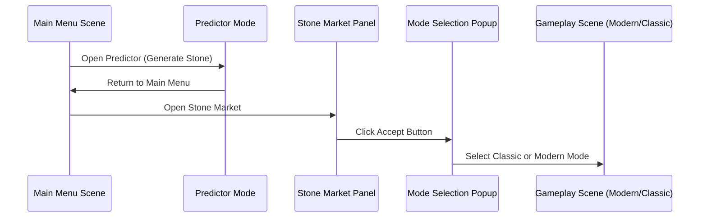
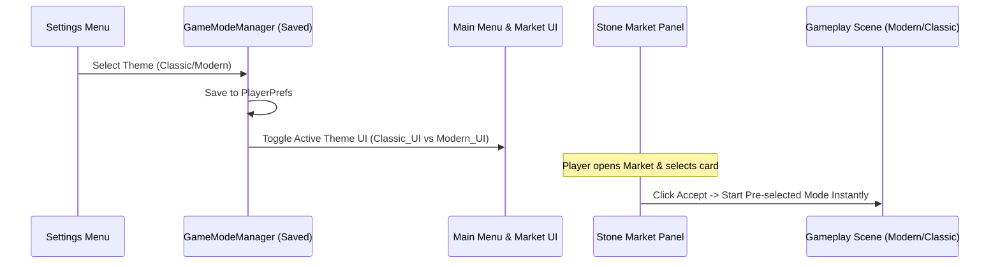

# GameFlow Architecture Report

This report outlines the design, implementation steps, and architectural blueprint for the new **Global Mode Selection** and **Dynamic UI Theme Switching** system in **unity.coremechanism.deonphizzle**. 

Please review this plan. Once approved, these changes will be implemented across the codebase.

---

## 1. Analysis: Current Flow vs. New Flow

### Old Flow (Current State)

* **UX Drawback:** Players must manually select Modern or Classic mode *every single time* they start a challenge, creating repetitive friction.
* **Theme Inconsistency:** The Main Menu and sub-panels do not adjust visually based on a selected mode; there is no cohesive theme representation.

### New Flow (Target State)

* **Unified Aesthetics:** Main Menu, Profile, Leaderboard, and Stone Market panels dynamically switch their designs (e.g., Version-1 Classic vs. Version-2 Modern) to reflect the active theme.
* **Frictionless Game Launch:** Clicking the Accept Button in the market loads the pre-selected gameplay scene instantly, bypassing the popup selection during the main flow.

---

## 2. Technical Challenges

1. **Persistent Global State**: Ensuring the active theme (`Classic` or `Modern`) is saved on the hard drive using `PlayerPrefs` and accessible globally across scene transitions via a Singleton manager.
2. **Dynamic UI Switching**: Configuring parent GameObjects (`Classic_UI` and `Modern_UI`) in the Main Menu and Stone Market panels to toggle active states based on the global theme.
3. **Refactoring Scene Loading**: Redirecting the marketplace's Accept button (`StoneItemUI`) to read the persistent theme and route the player directly to the correct gameplay scene.

---

## 3. Implementation Plan (Step-by-Step)

### Step 1: Create the Global `GameModeManager`
This script acts as the single source of truth for the active game theme.

* **Target File Path:** `Assets/Scripts/MVC/Models/GameModeManager.cs`
* **Proposed Code:**
```csharp
using UnityEngine;

public class GameModeManager : MonoBehaviour
{
    public static GameModeManager Instance;

    public enum GameTheme { Classic, Modern }
    public GameTheme currentTheme;

    private void Awake()
    {
        // Singleton pattern to ensure single cross-scene instance
        if (Instance == null)
        {
            Instance = this;
            DontDestroyOnLoad(gameObject);
            LoadTheme();
        }
        else
        {
            Destroy(gameObject);
        }
    }

    // Called from Settings panel to update and save the theme setting
    public void SetTheme(GameTheme newTheme)
    {
        currentTheme = newTheme;
        PlayerPrefs.SetInt("SavedGameTheme", (int)currentTheme);
        PlayerPrefs.Save();
        
        Debug.Log("Game Theme Changed To: " + currentTheme);
        
        // Notify any active theme appliers in the scene
        NotifyThemeAppliers();
    }

    private void LoadTheme()
    {
        // Default to Modern (1) if no preference is saved yet
        currentTheme = (GameTheme)PlayerPrefs.GetInt("SavedGameTheme", 1); 
    }

    private void NotifyThemeAppliers()
    {
        UIThemeApplier[] appliers = FindObjectsByType<UIThemeApplier>(FindObjectsSortMode.None);
        foreach (var applier in appliers)
        {
            applier.ApplyTheme();
        }
    }
}
```

---

### Step 2: Settings Theme Selector
This script interfaces with your settings UI buttons to trigger theme changes.

* **Target File Path:** `Assets/Scripts/MVC/Controllers/SettingsPanelController.cs`
* **Proposed Code:**
```csharp
using UnityEngine;

public class SettingsPanelController : MonoBehaviour
{
    public void SelectClassicMode()
    {
        if (GameModeManager.Instance != null)
        {
            GameModeManager.Instance.SetTheme(GameModeManager.GameTheme.Classic);
        }
        else
        {
            Debug.LogError("GameModeManager Instance not found!");
        }
    }

    public void SelectModernMode()
    {
        if (GameModeManager.Instance != null)
        {
            GameModeManager.Instance.SetTheme(GameModeManager.GameTheme.Modern);
        }
        else
        {
            Debug.LogError("GameModeManager Instance not found!");
        }
    }
}
```

---

### Step 3: Create the `UIThemeApplier`
This component is attached to main scene canvases to toggle theme-specific UI parent panels.

* **Target File Path:** `Assets/Scripts/MVC/Views/UIThemeApplier.cs`
* **Proposed Code:**
```csharp
using UnityEngine;

public class UIThemeApplier : MonoBehaviour
{
    [Header("Assign UI Parents")]
    public GameObject classicUIParent;
    public GameObject modernUIParent;

    void Start()
    {
        ApplyTheme();
    }

    public void ApplyTheme()
    {
        if (GameModeManager.Instance == null) return;

        bool isClassic = (GameModeManager.Instance.currentTheme == GameModeManager.GameTheme.Classic);

        if (classicUIParent != null) classicUIParent.SetActive(isClassic);
        if (modernUIParent != null) modernUIParent.SetActive(!isClassic);
        
        Debug.Log($"[UIThemeApplier] Applied Theme: {(isClassic ? "Classic" : "Modern")}");
    }
}
```

---

### Step 4: Integrate Game Mode Routing into `StoneItemUI`
We will replace the existing popup trigger in `ManualAcceptClick` to read the global theme setting and load the appropriate gameplay scene directly.

* **Target File Path:** `Assets/Scripts/MVC/Views/StoneItemUI.cs`
* **Proposed Modification:**
```csharp
    public void ManualAcceptClick()
    {
        Debug.Log("<color=cyan>🔥 Manual Accept Clicked: Routing directly to game scene...</color>");
        
        if (currentBlueprint != null)
        {
            GlobalStoneData.CurrentBlueprint = currentBlueprint; 

            // Check saved theme
            GameModeManager.GameTheme activeTheme = GameModeManager.GameTheme.Modern;
            if (GameModeManager.Instance != null)
            {
                activeTheme = GameModeManager.Instance.currentTheme;
            }
            else
            {
                activeTheme = (GameModeManager.GameTheme)PlayerPrefs.GetInt("SavedGameTheme", 1);
            }

            // Route dynamically based on setting
            string targetScene = (activeTheme == GameModeManager.GameTheme.Classic) 
                ? "StoneCuttingScene_Classic" 
                : "StoneGenerator Scene";

            Debug.Log($"Loading game mode: {activeTheme} -> Scene: {targetScene}");
            SceneManager.LoadScene(targetScene);
        }
    }
```

---

## 4. Editor Setup Guide
Once the code is deployed, the following configuration steps must be performed in the Unity Editor:
1. **Create GameManager**: Create an empty GameObject named `GameManager` in the `MainMenu` scene and attach the `GameModeManager` component to it.
2. **Hook Up Settings Buttons**: In your Settings menu, bind the `Classic` button to `SettingsPanelController.SelectClassicMode()` and the `Modern` button to `SettingsPanelController.SelectModernMode()`.
3. **Configure Panel Parents**: Attach the `UIThemeApplier` component to the Canvas / Main UI manager, and drag your Figma-designed Classic UI parent panel and Modern UI parent panel into their respective fields.
