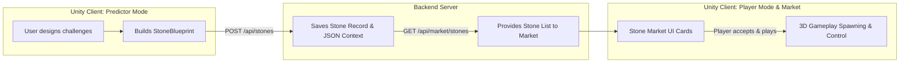

# 📊 Data Reference List: Predictor Mode ⇄ Backend API ⇄ Player Mode / Stone Market

This document specifies the exact data lists and payloads that are communicated between **Predictor Mode** (client), the **Backend Server/SDK**, and **Player Mode / Stone Market** (client). This specification is designed to help the backend developer build the production-ready SDK and database schemas.

---

## 🔄 The Data Handoff Pipeline



---

## 1️⃣ Data Sent: Predictor Mode ➔ Backend Server

When a custom stone is created in Predictor Mode, the client invokes the SDK save method:
`_client.SaveStone(string name, StoneSizeType sdkSize, string sdkColorHex, int sdkJadeCount, string jsonContext)`

### A. High-level SDK Call Parameters (Query / Body Params)
These top-level fields are sent to classify the stone in the database index:

| Field Name | Data Type | Value Range / Example | Description |
| :--- | :--- | :--- | :--- |
| **`name`** | `string` | `"Generated Jade"` | Display name of the stone. |
| **`sdkSize`** | `int` (Enum) | `0` = Small, `1` = Medium, `2` = Large | The stone size categorization. |
| **`sdkColorHex`**| `string` | `"98FB98"`, `"006400"`, `"50C878"`, `"1C542D"` | Hex color code of the jade core. |
| **`sdkJadeCount`**| `int` | `1`, `3`, `5` | The count of internal jade core segments. |
| **`jsonContext`** | `string` (JSON) | *(Full StoneBlueprint payload)* | Serialized JSON containing all GDD rules and movement step timelines. |

### B. Structure of the `jsonContext` (`StoneBlueprint`)
The backend must store this entire class structure inside the database (typically in a JSON column or text field). Here are the exact fields inside the serialized JSON:

#### 1. Core Metadata & Economy Fields
| Field Name | Data Type | Example Value | Description |
| :--- | :--- | :--- | :--- |
| **`stone_uid`** | `string` | `"7876d75c-bfde-4b11-bdfc-8828b4c5ee49"` | Globally unique ID generated by the client. |
| **`challenge_points`**| `int` | `8500` | Points reward awarded to player on successful cut. |
| **`total_weight_kg`** | `int` | `24` | Weight shown on Stone Market cards (5 to 30 kg). |
| **`stone_icon_index`**| `int` | `2` | Index of the card graphic (0 to 3). |
| **`stone_size_label`**| `string` | `"Medium"`, `"Small"`, `"Large"` | Text display string corresponding to size thresholds. |
| **`adversity_level`** | `string` | `"Low"`, `"Medium"`, `"High"` | Mapped from selected adversity Enum. |

#### 2. Physical & Material Properties (`physics_and_material`)
| Field Name | Data Type | Example Value | Description |
| :--- | :--- | :--- | :--- |
| **`size_scale`** | `float` | `1.0` | 3D mesh local scaling multiplier. |
| **`density`** | `string` | `"Light"`, `"Normal"`, `"Heavy"` | Mapped to rigidbody mass. |
| **`stress`** | `string` | `"Low"`, `"Medium"`, `"High"` | Internal physics stress indicator. |
| **`fracture_tolerance`**| `string` | `"Fragile"`, `"Normal"`, `"Strong"` | Breaking tolerance settings. |

#### 3. Rotation Properties (`rotation_system`)
| Field Name | Data Type | Example Value | Description |
| :--- | :--- | :--- | :--- |
| **`speed`** | `float` | `60.0` | Rotation speed value. |
| **`rotation_angle`** | `float` | `45.0` | Spin axis inclination angle. |
| **`rotation_pattern`**| `string` | `"LeftToRight"`, `"RightToLeft"` | Spin direction pattern. |
| **`spin_speed`** | `string` | `"Slow"`, `"Fast"` | Spin speed profile. |

#### 4. Anchor Network Details (`anchor_network`)
| Field Name | Data Type | Example Value | Description |
| :--- | :--- | :--- | :--- |
| **`type`** | `string` | `"Free"`, `"Grounded"`, `"WallAttached"`| 3D placement rules. |
| **`point_count`** | `int` | `4` | Number of targets/anchors that must be cut. |

#### 5. Jade Core Configuration (`jade_core`)
| Field Name | Data Type | Example Value | Description |
| :--- | :--- | :--- | :--- |
| **`color_rating`** | `string` | `"50C878"` | Hex string used for rendering jade shaders. |
| **`quantity_mass`** | `int` | `3` | Quantity count corresponding to mass scale. |

#### 6. GDD Gameplay Challenge Rules (`predictor_challenge_data`)
| Field Name | Data Type | Example Value | Description |
| :--- | :--- | :--- | :--- |
| **`predictorId`** | `string` | `"user_maya_99"` | Creator identity ID. |
| **`deterministicSeed`**| `int` | `45892` | Replay generation seed to lock randomness. |
| **`reputationScore`** | `float` | `4.5` | Creator reputation rating. |
| **`minimumSkillRequired`**| `int` (Enum) | `0`=Initiate, `1`=Cutter, `2`=Carver... | Skill tier constraints. |
| **`difficultyMultiplier`**| `float` | `1.5` | Reward scaling index. |
| **`coreMovement`** | `int` (Enum) | `0`=Static, `1`=Linear, `4`=Oscillation...| Base position movement style. |
| **`rotationPattern`** | `int` (Enum) | `0`=None, `1`=Circular, `7`=Chaotic... | Rotational movement style. |
| **`loopBehavior`** | `int` (Enum) | `0`=Continuous, `1`=PingPong... | Animation looping behavior. |
| **`challengeDuration`**| `int` (Enum) | `10`, `15`, `30`, `60`, `90`, `120` (sec)| Game timer duration limit. |
| **`speedMode`** | `int` (Enum) | `3` = ManualSlider | Motion velocity mode. |
| **`manualSpeedSlider`**| `float` | `60.0` | Custom movement speed slider value. |
| **`jitterAmount`** | `float` | `15.0` | Physics micro-shake magnitude. |
| **`driftSpeed`** | `float` | `0.5` | Position drift velocity offset. |
| **`loopOffset`** | `Vector3` | `{"x": 0.0, "y": 1.0, "z": 0.0}` | Spatial offset mapping. |
| **`globalTrap`** | `int` (Enum) | `0`=None, `2`=FalseSymmetry... | Active psychological decoy trick. |
| **`maxStrikesAllowed`** | `int` | `3` | Maximum strikes allowed before failing. |
| **`commitFreezeTime`** | `float` | `2.0` | Lock duration on user interaction. |
| **`allowedTorchPeeks`** | `int` | `3` | Limited peek count for internal visual scanning.|
| **`scoreDecayRate`** | `float` | `50.0` | Point reduction speed while peeking. |
| **`targetScoreToWin`** | `float` | `5000.0` | Score barrier required for success. |
| **`targetStoneSize`** | `int` (Enum) | `0` = Small, `1` = Medium, `2` = Large | Targeted size class. |
| **`wagerAmount`** | `int` | `500` | Points wagered/staked by the creator. |
| **`isFairnessValidated`**| `bool` | `true` | Client-side validated puzzle solvability flag. |
| **`phaseTimeline`** | `List<Phase>` | *(See schema layout below)* | List of phase-specific behaviors. |
| **`movementSequence`** | `List<Step>` | *(See schema layout below)* | Custom user-designed time-step timeline. |

##### Nested Structure: `phaseTimeline[]` (Phase Behavior List)
*   **`startTime`** *(float)*: When this phase begins (seconds from start).
*   **`duration`** *(float)*: How long this phase lasts.
*   **`phaseMovement`** *(int Enum)*: Movement type for this phase.
*   **`phasePattern`** *(int Enum)*: Rotation pattern for this phase.
*   **`trapType`** *(int Enum)*: Trap behavior used in this phase.
*   **`phaseSpeedMultiplier`** *(float)*: Velocity modifier.

##### Nested Structure: `movementSequence[]` (Time Step Timeline List)
*   **`duration`** *(float)*: Time step duration.
*   **`movementPattern`** *(string)*: Mapped motion string (`"Static"`, `"Linear"`, `"Oscillation"`, etc.).

---

## 2️⃣ Data Received: Backend Server ➔ Player Mode & Stone Market

When listing stones in the Stone Market, the backend returns a collection of saved stones. 

### A. Server Response Payload Structure (`StoneData`)
For each stone, the SDK must deserialize this JSON format returned from the endpoint:

```json
{
  "Id": 999,
  "Name": "Mock Jade Matrix (Local)",
  "StoneSize": 1, 
  "JadeCount": 3,
  "JsonContext": "{\"stone_uid\":\"...\",\"challenge_points\":8500,...}"
}
```

| Field Name | Data Type | Source | Description |
| :--- | :--- | :--- | :--- |
| **`Id`** | `int` | Server DB | Auto-incremented primary key. |
| **`Name`** | `string` | User Input | Display name of the custom stone challenge. |
| **`StoneSize`** | `int` (Enum) | User Choice | Size representation classification. |
| **`JadeCount`** | `int` | User Choice | Core count value. |
| **`JsonContext`** | `string` (JSON) | Serialized Blueprint | The exact JSON context saved during predictor creation. |

### B. Client Decoding & Gameplay Consumption
The client parses `JsonContext` back into the `StoneBlueprint` object to configure 3D Spawning and Movement Mechanics:

1. **Procedural 3D Mesh Generation (`StoneSpawner.cs`)**:
   - Scales physical mesh based on `StoneSize` (`Small` = `0.5x`, `Medium` = `0.75x`, `Large` = `1.0x`).
   - Mapped `physics_and_material.density` sets the Rigidbody mass values (`Light` = 5, `Normal` = 20, `Heavy` = 50).
   - `jade_core.color_rating` assigns colors to materials using raw hex values.
   - `anchor_network.point_count` determines the amount of anchor points spawned.

2. **Kinematic Motion Engine (`PredictorMotionController.cs` & `StoneSpinController.cs`)**:
   - Reads `predictor_challenge_data.coreMovement` and `rotationPattern` to steer spatial paths.
   - Drives timelines step-by-step using `predictor_challenge_data.movementSequence` list.
   - Implements `jitterAmount` to apply chaotic shakes to transforms.
   - Applies linear drift shifts utilizing the `driftSpeed` and `loopOffset` vectors.

3. **Win / Loss Rules (`JadeCuttingGame.cs`)**:
   - Mapped `wagerAmount` is deducted from the player's profile balance.
   - Displays `challenge_points` as the potential win prize.
   - Restricts strikes using `maxStrikesAllowed` values.
   - Configures points deductions during peeking based on `scoreDecayRate`.

---

## 3️⃣ User Profile & Ledger API Data

For score updates, wagers, and leaderboards, the SDK must communicate these profiles:

### A. User Profile JSON (`UserProfileData`)
```json
{
  "userId": "usr_948194",
  "userName": "Maya",
  "avatarUrl": "https://cdn.stonecutter.io/avatars/maya.png",
  "totalPoints": 45000,
  "currentTier": 3,
  "currentPoints": 12897,
  "maxPointsForTier": 20000,
  "stonesPlayed": 1245,
  "perfectCuts": 426,
  "failedCuts": 127,
  "tierStatus": "Gold"
}
```

### B. Leaderboard Data Structure (`LeaderboardPlayer`)
```json
{
  "rank": 3,
  "playerName": "Md. Gazi Fahim",
  "tier": "Gold",
  "points": 117500,
  "avatarUrl": "https://cdn.stonecutter.io/avatars/fahim.png"
}
```

---

> [!NOTE]
> All parameters inside `jsonContext` are mandatory to maintain simulation consistency between the player who predicted/designed the stone and the challenger trying to cut it.
