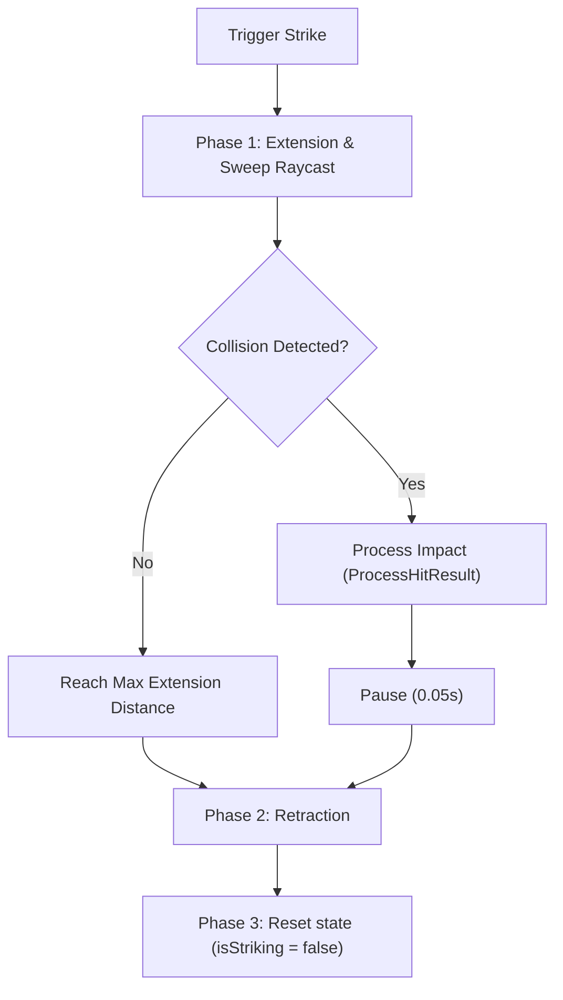

# Technical Analysis: Manual Chisel Hit & Collision Logic

This report analyzes the mechanical strike, collision detection, and impact processing logic triggered when the hit button is clicked in the [ManualChiselController.cs](file:///C:/Users/User/Documents/GitHub/unity.coremechanism.deonphizzle/Assets/Scripts/Chisel/ManualChiselController.cs) component.

---

## 🚀 1. Triggering the Strike (`StrikeStone`)

When the user clicks the UI **HIT** button, it invokes the public method `StrikeStone()`:

```csharp
public void StrikeStone()
{
    if (!isEquipped) return;
    if (!isStriking && extendBone != null && chiselTip != null)
    {
        StartCoroutine(StrikeRoutine());
    }
}
```

*   **Safety Guards**: 
    1.  The tool must be currently equipped (`isEquipped == true`).
    2.  A strike cannot overlap another ongoing strike (`isStriking == false`).
    3.  Critical bone references (`extendBone` and `chiselTip`) must be assigned.
*   **Action**: Initiates the `StrikeRoutine()` Coroutine to handle the mechanical movement.

---

## 📏 2. Mechanical Extension & Sweep Collision (`StrikeRoutine`)

The core execution of the hit is split into three phases inside the `StrikeRoutine()` coroutine:



### Phase 1: Forward Extension & Continuous Raycasting
1.  **Calculate Target Position**: The destination local position of the `extendBone` is calculated along the `strikeAxis` scaled by `maxExtensionDistance`:
    ```csharp
    Vector3 targetLocalPos = initialExtendLocalPos + (strikeAxis.normalized * maxExtensionDistance);
    ```
2.  **Translate Forward**: Moves the `extendBone.localPosition` toward the target position using `Vector3.MoveTowards` at `hitSpeed * Time.deltaTime`.
3.  **Sweep Raycast**: To prevent the chisel from passing through stone geometry at high speed, the script performs a sweep raycast at each frame using the chisel tip's frame-to-frame movement delta:
    ```csharp
    Vector3 moveDirection = currentTipPos - previousTipPos;
    float moveDistance = moveDirection.magnitude;
    RaycastHit[] hits = Physics.RaycastAll(previousTipPos, moveDirection.normalized, moveDistance);
    ```
4.  **Target Filtering**: Iterates through all raycast hits. It filters out parts of its own chisel rig and matches objects with:
    *   `StoneGenerator` or `HitAnchor` components.
    *   Tags matching `"Stone"` or `"Jade"`.
5.  **Impact Lock**: If a valid stone target is hit, `impactOccurred` is set to `true`, forward movement stops immediately, and `ProcessHitResult` is triggered.

### Phase 2: Retraction
*   If an impact occurred, the coroutine pauses for `0.05` seconds.
*   Translates the `extendBone.localPosition` back toward `initialExtendLocalPos` at `returnSpeed * Time.deltaTime`.

### Phase 3: Reset
*   Forces `extendBone.localPosition = initialExtendLocalPos` to ensure absolute stability.
*   Sets `isStriking = false` to allow the next hit.

---

## 💥 3. Impact & Effect Processing (`ProcessHitResult`)

When a valid collision is registered, `ProcessHitResult()` handles the game state and effects:

### Game Logic Actions
*   **If a `HitAnchor` is hit**:
    *   Calls `stoneManager.RegisterToolStrike()`.
    *   Calls `stoneManager.AnchorDestroyed(anchor)`.
    *   Destroys the anchor's GameObject.
*   **If a `StoneGenerator` body is hit**:
    *   Calls `stoneGen.RegisterToolStrike()` to register a general surface scratch.

### Effects Spawned (`TriggerHitEffects`)
*   **Visual Effects**: Spawns `hitEffectPrefab` (primary sparks) and `secondaryHitEffectPrefab` (secondary dust/sparks) aligned with the hit surface normal.
*   **Audio Effects**: Plays `primaryHitSound` and `secondaryHitSound` at the impact point using `AudioSource.PlayClipAtPoint()`.
