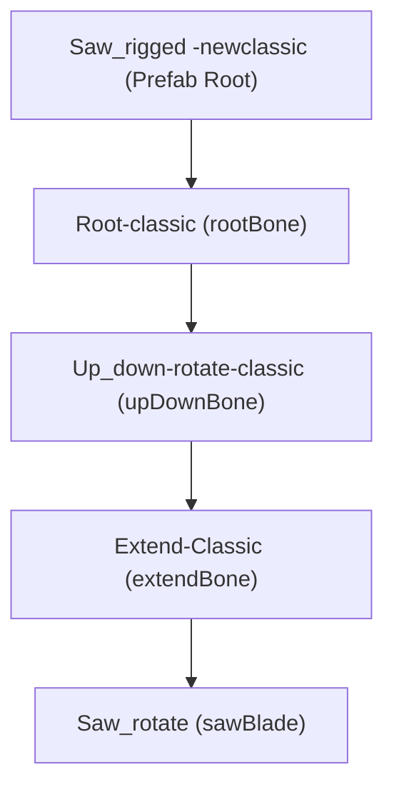

# Technical Report: Classic Rigged Saw Joystick & Movement Analysis

This report provides a detailed breakdown of the joystick control, mechanical movement, and bone-alignment systems for the classic rigged saw (**`Saw_rigged -newclassic`**) controlled by the [SawArmController.cs](file:///C:/Users/User/Documents/GitHub/unity.coremechanism.deonphizzle/Assets/Scripts/Saw/SawArmController.cs) script in `StoneCuttingScene_Classic.unity`.

---

## 🏗️ 1. Bone Hierarchy & Armature Alignment

The rigged classic saw model utilizes a nested armature structure to translate joystick inputs into coordinate rotations and physical extensions:



### Bone Mapping Details
*   **Root Bone (`Root-classic`)**:
    *   *Role*: Controls horizontal yaw (left/right rotation).
    *   *Orientation*: Its local X-axis `(1, 0, 0)` points vertically down in parent space.
    *   *Yaw Axis*: Set to `{x: 1, y: 0, z: 0}` in the scene component.
*   **Tilt Bone (`Up_down-rotate-classic`)**:
    *   *Role*: Controls vertical pitch (up/down tilting).
    *   *Orientation*: Its local Z-axis `(0, 0, 1)` points horizontally.
    *   *Pitch Axis*: Set to `{x: 0, y: 0, z: 1}` in the scene component.
*   **Extension Bone (`Extend-Classic`)**:
    *   *Role*: Translates the saw blade forward/backward.
    *   *Orientation*: Aligned with the local negative X-axis of the bone.
    *   *Extend Axis*: Set to `{x: -1, y: 0, z: 0}` in the scene component.
*   **Blade Transform (`Saw_rotate`)**:
    *   *Role*: Spins the saw blade constantly.
    *   *Spin Axis*: Set to `{x: 0, y: 0, z: 1}` in local space.

---

## 🕹️ 2. Joystick Control & Input Mapping

The aiming system in `SawArmController` translates virtual joystick inputs into rotations on the respective bones during `Update()`.

### Axis-Locking (Cardinal Mode)
To mimic a heavy, rail-mounted industrial slicing machine, the joystick uses an axis-locking mechanic that restricts movement to one cardinal direction at a time:
```csharp
if (Mathf.Abs(joyX) >= Mathf.Abs(joyY)) joyY = 0f;
else joyX = 0f;
```
*   If horizontal input is dominant, vertical input is ignored.
*   If vertical input is dominant, horizontal input is ignored.

### Control Directions & Inversions
*   **Horizontal (Joystick X)**:
    *   Controls `Root-classic` yaw.
    *   Inverted programmatically (`invertJoystickX = true`), which rotates the root bone left/right matching the natural screen space direction.
    *   Limits: Clamped between `-45` and `45` degrees.
*   **Vertical (Joystick Y)**:
    *   Controls `Up_down-rotate-classic` pitch.
    *   Non-inverted (`invertJoystickY = false`).
    *   Limits: Clamped between `-60` and `60` degrees.

---

## 🪚 3. Mechanical Extension & Slicing Trigger

Unlike the chisel and hammer which perform automated strike routines, the saw uses manual extension controlled by UI buttons:

1.  **UI Buttons**: Pressing the `MoveForward` button translates the `Extend-Classic` bone along the `extendAxis` `(-1, 0, 0)` at `extendSpeed = 5`.
2.  **Continuous Collision Checking**: As the arm extends forward, a continuous `Linecast` is cast in front of the blade to check if the path is blocked by a stone collider:
    ```csharp
    Physics.Linecast(startPos, endPos, out hit, stoneLayer)
    ```
3.  **Automatic Slicing & Grinding**:
    *   When the blade makes contact with the stone, physical movement is paused (`pathBlocked = true`).
    *   Grinding audio, water jets, and sparks particle effects are triggered.
    *   The `SliceStoneAtBladePosition()` method is executed immediately to cut the stone mesh in half using the `EzySlice` utility along the blade's rotation plane (`bladeCutNormal = (0, 0, 1)`).

---

## 🔍 4. Verification Verdict
The axis assignments (`yawAxis = (1, 0, 0)`, `pitchAxis = (0, 0, 1)`, and `extendAxis = (-1, 0, 0)`) in `StoneCuttingScene_Classic.unity` match the bone coordinate systems perfectly. The axis-locking mechanism enforces correct mechanical behavior, and the automatic slicing triggers instantly upon blade collision. The controls are fully calibrated.
