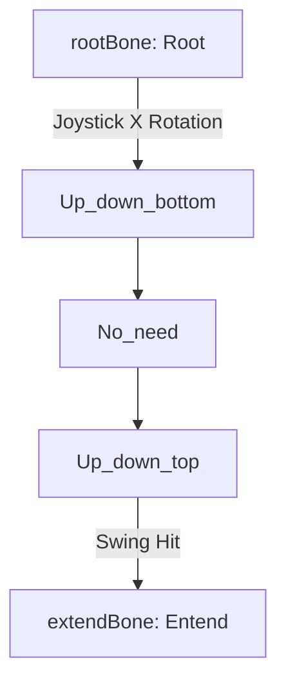
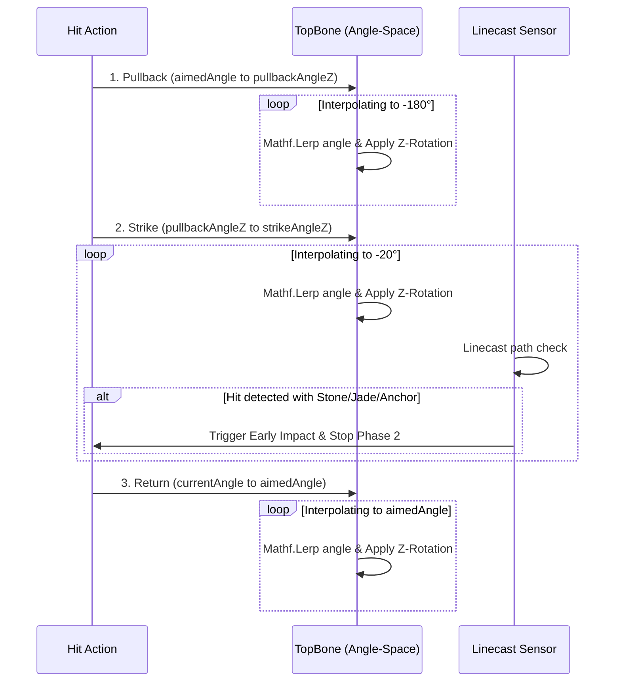

# Rigged Hammer Architecture & Single-Axis "Wrist" Fix

This document provides a comprehensive breakdown of the **Rigged Hammer Assembly (`Hammer_rigged`)** mechanical architecture, bone hierarchy, and the mathematical implementation of the single-axis swing mechanism. It documents the causes of the "wrist-like" twisting issue and how it was fixed.

---

## 1. Hierarchy & Component Mapping

The active rigged hammer (`Hammer_rigged`) operates via an skeletal armature. Only specific bone transforms are modified by [NewHammerController.cs](file:///C:/Users/User/Documents/GitHub/unity.coremechanism.deonphizzle/Assets/Scripts/Hammer/NewHammerController.cs):



### Bone Roles

| Variable Name in Script | Target Bone in Scene | Mechanical Role | Active Axis (Local) |
| :--- | :--- | :--- | :--- |
| **`rootBone`** | `Root` | Yaw Pivot (Left/Right base sweep) | **X-axis** `(1, 0, 0)` |
| **`topBone`** | `Up_down_bottom` | Pitch & Strike Pivot (Up/Down tilt & Swing) | **Z-axis** `(0, 0, 1)` |
| **`extendBone`** | `Entend` | Piston (Unmoved; acts as raycast pivot) | *No motion* |
| **`hammerTip`** | `Entend` / Tip Child | Collision Sensor | Continuous Linecast source |

---

## 2. The "Wrist-Like" Twisting Problem & Solution

### The Issue
Previously, when clicking the hit button, the hammer head rotated along a curved, twisting path (resembling a human wrist roll) rather than a clean, flat swing. This was caused by two main problems:
1. **Wrong Axis Configuration**: In the Unity inspector, the `tiltRotationAxis` for the `Up_down_bottom` bone was set to `{x: 1, y: 0, z: 0}`. Since the bone's actual physical joint swings on the Z-axis, this forced it to rotate around the wrong coordinate plane.
2. **Quaternion Slerping Artifacts**: The swing logic used spherical linear interpolation (`Quaternion.Slerp`) between three rotation states. Because the bone has a pre-existing 180-degree rotation offset around Y (`y = -180`), Slerp attempted to resolve the shortest 3D rotation path, introducing yaw and roll drift (twisting).

### The Fix
To ensure 100% flat, single-axis rotation:
1. **Z-Axis Setting**: The `tiltRotationAxis` was corrected to Z-axis `{x: 0, y: 0, z: 1}` inside the scene [StoneGenerator Scene.unity](file:///C:/Users/User/Documents/GitHub/unity.coremechanism.deonphizzle/Assets/ALL-SCENE-IS%20HERE/StoneGenerator%20Scene.unity#L256).
2. **1D Float Angle Interpolation**: The coroutine was refactored to interpolate the **angle float** directly using `Mathf.Lerp` and apply it to a single axis via `Quaternion.AngleAxis`:
   $$Rotation = OriginalTopRotation \times Quaternion.AngleAxis(\theta - \theta_{start}, Axis_{tilt})$$

---

## 3. Asynchronous Swing & Hit Sequence

The strike mechanism is performed asynchronously in three distinct phases (with piston translation completely removed for structural integrity):



### Pure Angle-Space Swing Code

```csharp
IEnumerator MechanicalSwingSequence(Vector3 targetPoint, Vector3 surfaceNormal, Collider stoneCollider)
{
    isHitting = true;

    float aimedAngle = currentTiltZ;
    float pullbackAngle = pullbackAngleZ;
    float strikeAngle = strikeAngleZ;

    // PHASE 1: Pullback (-180 degrees)
    float t = 0;
    while (t < 1f)
    {
        t += Time.deltaTime * swingSpeed;
        float angle = Mathf.Lerp(aimedAngle, pullbackAngle, t);
        topBone.localRotation = originalTopRotation * Quaternion.AngleAxis(angle - startingTiltZ, tiltRotationAxis.normalized);
        yield return null;
    }

    // PHASE 2: Strike & Extend (-20 degrees)
    t = 0;
    Vector3 previousTipPos = hammerTip.position;
    bool impactOccurred = false;
    float currentSwingAngle = pullbackAngle;

    while (t < 1f && !impactOccurred)
    {
        t += Time.deltaTime * swingSpeed;
        currentSwingAngle = Mathf.Lerp(pullbackAngle, strikeAngle, t);
        
        topBone.localRotation = originalTopRotation * Quaternion.AngleAxis(currentSwingAngle - startingTiltZ, tiltRotationAxis.normalized);

        Vector3 currentTipPos = hammerTip.position;
        if (Physics.Linecast(previousTipPos, currentTipPos, out RaycastHit tipHit))
        {
            if (!tipHit.collider.transform.IsChildOf(this.transform))
            {
                StoneGenerator stoneGen = tipHit.collider.GetComponentInParent<StoneGenerator>();
                HitAnchor anchor = tipHit.collider.GetComponent<HitAnchor>();
                if (anchor == null) anchor = tipHit.collider.GetComponentInParent<HitAnchor>();

                if (stoneGen != null || anchor != null || tipHit.collider.CompareTag("Stone") || tipHit.collider.CompareTag("Jade"))
                {
                    impactOccurred = true;
                    HandleImpact(tipHit.point, tipHit.normal, tipHit.collider);
                }
            }
        }
        previousTipPos = currentTipPos;
        yield return null;
    }

    if (!impactOccurred)
    {
        topBone.localRotation = originalTopRotation * Quaternion.AngleAxis(strikeAngle - startingTiltZ, tiltRotationAxis.normalized);
        HandleImpact(targetPoint, surfaceNormal, stoneCollider);
        currentSwingAngle = strikeAngle;
    }

    yield return new WaitForSeconds(0.15f);

    // PHASE 3: Return & Retract (Return to aimedAngle)
    t = 0;
    while (t < 1f)
    {
        t += Time.deltaTime * returnSpeed;
        float angle = Mathf.Lerp(currentSwingAngle, aimedAngle, t);
        topBone.localRotation = originalTopRotation * Quaternion.AngleAxis(angle - startingTiltZ, tiltRotationAxis.normalized);
        yield return null;
    }
    topBone.localRotation = originalTopRotation * Quaternion.AngleAxis(aimedAngle - startingTiltZ, tiltRotationAxis.normalized);

    isHitting = false; 
}
```
