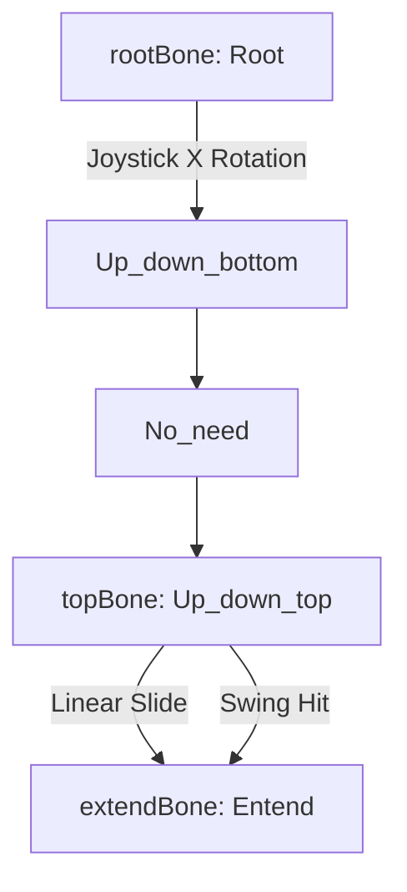
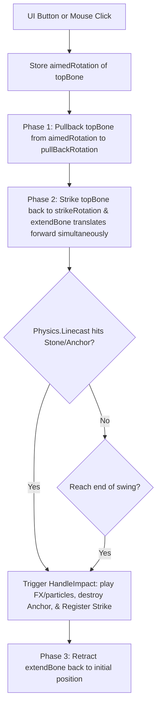

# Rigged Hammer & Controller Movement Mechanism

This document describes the mechanical and mathematical calculations used to control the movements of the **Rigged Hammer Assembly** using the joystick and strike button inputs in [NewHammerController.cs](file:///C:/Users/User/Documents/GitHub/unity.coremechanism.deonphizzle/Assets/Scripts/Hammer/NewHammerController.cs).

---

## 1. Hierarchy & Component Mapping

In the scene [StoneGenerator Scene.unity](file:///C:/Users/User/Documents/GitHub/unity.coremechanism.deonphizzle/Assets/ALL-SCENE-IS HERE/StoneGenerator Scene.unity), the active rigged hammer (`Hammer_rigged`) binds the following bones:



| Field in Script | Bone Transform | Rig / Mechanical Role |
| :--- | :--- | :--- |
| **`rootBone`** | `Root` | Yaw Pivot: Rotates the entire assembly Left/Right (Yaw) on its `rootRotationAxis` (defaults to X-axis `(1,0,0)` for 360-degree rotation). |
| **`topBone`** | `Up_down_bottom` | Pitch Pivot: Tilts the head Up/Down (Pitch) on the Z-axis `(0,0,1)` for vertical aiming, and performs the swing strike. |
| **`extendBone`** | `Entend` | Piston: Translates the hammer head Forward/Backward along `extendAxis` towards the target point on the stone. |
| **`hammerTip`** | `Entend` (or child tip) | Collision sensor: Projects the continuous linecast to detect the point of impact. |

---

## 2. Joystick Aiming & Axis Locking

Aiming is driven by a virtual joystick (`virtualJoystick`) with the following rules:

*   **Axis Locking (Drift Prevention)**:
    Whichever axis has the larger input magnitude becomes the active axis, and the other is set to `0` for that frame:
    ```csharp
    if (Mathf.Abs(joyX) >= Mathf.Abs(joyY))
    {
        joyY = 0f; // Lock vertical movement
    }
    else
    {
        joyX = 0f; // Lock horizontal movement
    }
    ```
*   **Yaw Aiming (`rootBone`)**:
    Rotates the root bone around the configurable `rootRotationAxis` (clamped between `-360` and `+360` degrees):
    ```csharp
    currentRootAngle += joyX * rootTurnSpeed * Time.deltaTime;
    rootBone.localRotation = initialRootLocalRot * Quaternion.AngleAxis(currentRootAngle, rootRotationAxis.normalized);
    ```
*   **Pitch Aiming & Translation (`topBone`)**:
    Controls the vertical alignment of the hammer arm using Joystick Y (`joyY`):
    *   **Z-Axis Translation (Movement)**:
        *Disabled to prevent the rigged model from separating/breaking. The armature's mechanical structure operates entirely via rotation.*
    *   **Z-Axis Tilt (Rotation)**:
        Controls the absolute local Z rotation of the arm (clamped between `-180` and `-20` degrees) relative to its cached original rotation:
        ```csharp
        currentTiltZ -= joyY * tiltSpeed * Time.deltaTime;
        currentTiltZ = Mathf.Clamp(currentTiltZ, minTiltZ, maxTiltZ);
        topBone.localRotation = originalTopRotation * Quaternion.AngleAxis(currentTiltZ - startingTiltZ, tiltRotationAxis.normalized);
        ```

---

## 3. Strike Swing Sequence

The strike sequence can be triggered by mouse clicks or via the public `StrikeStone()` method linked to a UI button:

### Raycast Target Point Selection (`StrikeStone()`)
If triggered via a UI button, the script casts a ray forward in the direction of the current aimed extension:
```csharp
Vector3 worldExtendDir = extendBone.parent.TransformDirection(extendAxis.normalized);
Ray ray = new Ray(extendBone.position, worldExtendDir);
```
If the ray hits a stone, it uses that exact hit point. Otherwise, it defaults to a point `10m` straight ahead.

### Swing Phases (Aimed-Relative Piston Hit)


1.  **Phase 1 (Pullback)**: Swings the `topBone` backwards from its current aimed rotation to the pulled-back rotation (`pullBackRotation`). The piston remains retracted.
    ```csharp
    Quaternion aimedRotation = topBone.localRotation;
    Quaternion pullBackRotation = originalTopRotation * Quaternion.AngleAxis(pullbackAngleZ - startingTiltZ, tiltRotationAxis.normalized);
    ```
2.  **Phase 2 (Strike & Extension)**: Swings the `topBone` forward back to `aimedRotation` while simultaneously extending the piston `extendBone` forward towards `targetExtendLocalPos`.
    During this phase, a continuous `Physics.Linecast` checks the path of the hammer tip. If it hits a stone or anchor, it triggers the impact early.
    ```csharp
    Quaternion strikeRotation = aimedRotation;
    ```
3.  **Phase 3 (Retraction)**: Retracts `extendBone` back to its starting position, while the arm remains at `aimedRotation`.

### Raycast Target Point Selection (`StrikeStone()` & Mouse Clicks)
To prevent self-collision with the hammer body, the script performs a `Physics.RaycastAll` along the aiming ray and filters out any colliders belonging to the hammer itself, finding the closest valid target:
```csharp
RaycastHit[] hits = Physics.RaycastAll(ray, 100f);
```
Valid targets include objects with `StoneGenerator` components, `HitAnchor` components, or tagged with `"Stone"` or `"Jade"`.
If a target is hit, the script calculates the required extension and triggers the swing sequence. If no target is found, it defaults to a fallback point 10 meters ahead of the piston.
