# Game Mode Selection Refactoring Plan

This document outlines the proposed changes to the game mode selection logic in **unity.coremechanism.deonphizzle**. 

Currently, the mode selection panel is shown at the end of the stone selection process (when accepting a card in the marketplace). The goal is to move the Mode Selection Panel to the Settings menu as a global preference, persist the chosen mode, and load the pre-selected mode immediately upon selecting a stone in the marketplace.

---

## 1. Architectural Changes Overview

```mermaid
graph TD
    %% New Settings-driven configuration flow
    subgraph Settings Menu Configuration
        ClickSettings[Click Settings Button] --> OpenSelector[Open ModeSelectionPanel via Setting Button]
        OpenSelector --> SelectMode{Select Mode}
        SelectMode -->|Modern| SaveModern[Save Mode = Modern in PlayerPrefs & StoneServer]
        SelectMode -->|Classic| SaveClassic[Save Mode = Classic in PlayerPrefs & StoneServer]
        SaveModern --> CloseSelector[Close ModeSelectionPanel]
        SaveClassic --> CloseSelector
    end

    %% New Instant Match Launch Flow
    subgraph Marketplace Selection & Game Launch
        ClickAccept[Click Accept on Stone Prefab Card] --> CheckSavedMode{Get Saved Mode}
        CheckSavedMode -->|Modern| LaunchModern[Load: StoneGenerator Scene]
        CheckSavedMode -->|Classic| LaunchClassic[Load: StoneCuttingScene_Classic]
    end
    
    %% Next Challenge Redirect
    subgraph Next Challenge Redirect
        ClickNextChallenge[Click Next Challenge in Game] --> SetPref[Set AutoOpenStoneMarket = 1]
        SetPref --> LoadMenu[Load Main Menu Scene]
        LoadMenu --> CheckPref{Check AutoOpenStoneMarket}
        CheckPref -->|1| OpenStorePanel[MainMenuController opens Stone Market Panel]
    end
```



---

## 2. Key Refactoring Actions

### A. Persist Selected Game Mode in [StoneServer.cs](file:///C:/Users/User/Documents/GitHub/unity.coremechanism.deonphizzle/Assets/Scripts/MVC/Models/StoneServer.cs)
Introduce helper methods to load and save `ChosenMode` from/to `PlayerPrefs` upon initialization and changes.

### B. Make [ModeSelectionManager.cs](file:///C:/Users/User/Documents/GitHub/unity.coremechanism.deonphizzle/Assets/Scripts/MVC/Controllers/ModeSelectionManager.cs) a Setting Handler
Instead of loading scenes directly inside `LoadModernMode()` and `LoadClassicMode()`, modify the click listeners to save the selected mode globally and close the panel.

### C. Update [StoneItemUI.cs](file:///C:/Users/User/Documents/GitHub/unity.coremechanism.deonphizzle/Assets/Scripts/MVC/Views/StoneItemUI.cs) for Direct Scene Load
Rewrite `ManualAcceptClick` to load the gameplay scene associated with the pre-selected game mode instantly, bypassing the popup selection.

### D. Fix the `"AutoOpenStoneMarket"` Flag in [MainMenuController.cs](file:///C:/Users/User/Documents/GitHub/unity.coremechanism.deonphizzle/Assets/Scripts/MVC/Controllers/MainMenuController.cs)
Change the "Next Challenge" redirect so that it opens the **Stone Market panel** (Store) instead of the Mode Selection Panel, aligning with the actual PlayerPref key name.

---

## 3. Code Modifications & Proposed Diffs

### 1. `StoneServer.cs` Modifications
We add PlayerPrefs integration to persist the selected mode.

```diff
     // 🌟 নতুন: প্লেয়ার কোন মোড সিলেক্ট করেছে তা সার্ভারে সেভ থাকবে
     public GameMode ChosenMode = GameMode.Modern; // ডিফল্ট মডার্ন থাকবে
 
     private void Awake()
     {
         if (Instance == null)
         {
             Instance = this;
             DontDestroyOnLoad(gameObject); // এক সিন থেকে অন্য সিনে গেলেও ডাটা মুছবে না
+            
+            // Load saved mode from PlayerPrefs
+            ChosenMode = (GameMode)PlayerPrefs.GetInt("SavedGameMode", (int)GameMode.Modern);
         }
         else
         {
             Destroy(gameObject);
         }
     }
+
+    // Save mode preference
+    public void SetSavedMode(GameMode mode)
+    {
+        ChosenMode = mode;
+        PlayerPrefs.SetInt("SavedGameMode", (int)mode);
+        PlayerPrefs.Save();
+    }
```

---

### 2. `ModeSelectionManager.cs` Modifications
Modify scene-loading methods to be state-saving methods instead.

```diff
     private void Start()
     {
         // Ensure the panel and dark background are kept off at the start
         if (modeSelectionPanel != null) modeSelectionPanel.SetActive(false);
         if (darkBackgroundOverlay != null) darkBackgroundOverlay.SetActive(false);
 
-        // Added click events to the buttons
-        if (modernModeButton != null) modernModeButton.onClick.AddListener(LoadModernMode);
-        if (classicModeButton != null) classicModeButton.onClick.AddListener(LoadClassicMode);
+        // Bind to the new state-saving methods
+        if (modernModeButton != null) modernModeButton.onClick.AddListener(SelectModernMode);
+        if (classicModeButton != null) classicModeButton.onClick.AddListener(SelectClassicMode);
         if (closeButton != null) closeButton.onClick.AddListener(ClosePanel);
-
-        // 🌟 New logic: If returning from the game scene via "Next Challenge", the panel will open automatically
-        if (PlayerPrefs.GetInt("AutoOpenModeSelection", 0) == 1)
-        {
-            // Clearing the signal so that the panel doesn't open automatically if returning to the main menu manually later
-            PlayerPrefs.SetInt("AutoOpenModeSelection", 0);
-            PlayerPrefs.Save();
-
-            // Function to open the panel and dark overlay
-            ShowPanel(); 
-        }
     }
 
-    public void LoadModernMode()
+    public void SelectModernMode()
     {
-        if (StoneServer.Instance != null) StoneServer.Instance.ChosenMode = GameMode.Modern;
-        Debug.Log("Modern Mode Selected. Loading...");
+        if (StoneServer.Instance != null)
+        {
+            StoneServer.Instance.SetSavedMode(GameMode.Modern);
+        }
+        else
+        {
+            PlayerPrefs.SetInt("SavedGameMode", (int)GameMode.Modern);
+            PlayerPrefs.Save();
+        }
+        Debug.Log("Saved setting: Modern Mode");
         
-        // It's better to turn off the panel before the scene loads
         ClosePanel(); 
-        SceneManager.LoadScene(modernSceneName);
     }
 
-    public void LoadClassicMode()
+    public void SelectClassicMode()
     {
-        if (StoneServer.Instance != null) StoneServer.Instance.ChosenMode = GameMode.Classic;
-        Debug.Log("Classic Mode Selected. Loading...");
+        if (StoneServer.Instance != null)
+        {
+            StoneServer.Instance.SetSavedMode(GameMode.Classic);
+        }
+        else
+        {
+            PlayerPrefs.SetInt("SavedGameMode", (int)GameMode.Classic);
+            PlayerPrefs.Save();
+        }
+        Debug.Log("Saved setting: Classic Mode");
         
-        // It's better to turn off the panel before the scene loads
         ClosePanel(); 
-        SceneManager.LoadScene(classicSceneName);
     }
```

---

### 3. `StoneItemUI.cs` Modifications
Check the saved preference and transition instantly to the selected scene.

```diff
     public void ManualAcceptClick()
     {
         Debug.Log("<color=cyan>🔥 MANUAL CLICK WORKED!</color>");
         
         if (currentBlueprint != null)
         {
             GlobalStoneData.CurrentBlueprint = currentBlueprint; 
             
-            if (ModeSelectionManager.Instance != null)
-            {
-                ModeSelectionManager.Instance.ShowPanel();
-            }
-            else
-            {
-                Debug.LogWarning("ModeSelectionManager.Instance is null, falling back to direct scene load.");
-                if (!string.IsNullOrEmpty(cuttingSceneName))
-                {
-                    SceneManager.LoadScene(cuttingSceneName); 
-                }
-            }
+            // Load saved preference
+            GameMode savedMode = GameMode.Modern;
+            if (StoneServer.Instance != null)
+            {
+                savedMode = StoneServer.Instance.ChosenMode;
+            }
+            else
+            {
+                savedMode = (GameMode)PlayerPrefs.GetInt("SavedGameMode", (int)GameMode.Modern);
+            }
+            
+            // Route to correct scene based on pre-selected mode
+            string targetScene = (savedMode == GameMode.Classic) ? "StoneCuttingScene_Classic" : "StoneGenerator Scene";
+            Debug.Log($"[StoneItemUI] Launching mode: {savedMode} -> Loading Scene: {targetScene}");
+            SceneManager.LoadScene(targetScene);
         }
     }
```

---

### 4. `WinLoseManager.cs` Modifications
Revert the key check back to `AutoOpenStoneMarket`.

```diff
     public void LoadNextChallenge()
     {
         Debug.Log("Redirecting to Stone Market in Main Menu...");
 
         // 🌟 সিগন্যাল সেভ করা হচ্ছে
-        PlayerPrefs.SetInt("AutoOpenModeSelection", 1);
+        PlayerPrefs.SetInt("AutoOpenStoneMarket", 1);
         PlayerPrefs.Save();
 
         // মেইন মেনু লোড করা হচ্ছে
         if (!string.IsNullOrEmpty(mainMenuSceneName))
         {
             SceneManager.LoadScene(mainMenuSceneName); 
         }
```

---

### 5. `MainMenuController.cs` Modifications
Add Singleton behavior and auto-open the Marketplace when returning from gameplay.

```diff
 public class MainMenuController : MonoBehaviour
 {
+    public static MainMenuController Instance;
+
     [Header("Top Bar Dynamic Data")]
     public TextMeshProUGUI tierText;
     public TextMeshProUGUI pointsText;
 
     [Header("Main Menu Panel")]
     public GameObject menuPanel; 
 
     [Header("Sub Panels")]
     public GameObject toolsPanel;
     public GameObject profilePanel;
     public GameObject leaderboardPanel;
     public GameObject storePanel;
 
+    private void Awake()
+    {
+        Instance = this;
+    }
+
     private void Start()
     {
         UpdateTopBarData();
+        
+        // Auto-open Marketplace (Store Panel) if returning from a challenge
+        if (PlayerPrefs.GetInt("AutoOpenStoneMarket", 0) == 1)
+        {
+            PlayerPrefs.SetInt("AutoOpenStoneMarket", 0);
+            PlayerPrefs.Save();
+            OpenStore();
+        }
     }
```

---

## 4. Summary of Benefits of the New Flow
1. **Frictionless Launch**: Players select a stone challenge in the market and start playing instantly without popup prompts.
2. **Dedicated Settings Control**: Players configure their gameplay mode globally (Modern/Classic) inside settings, reinforcing separate, persistent progression styles.
3. **Correct UI Auto-Navigation**: Next Challenge correctly returns to the Marketplace page automatically, ready for another selection.
