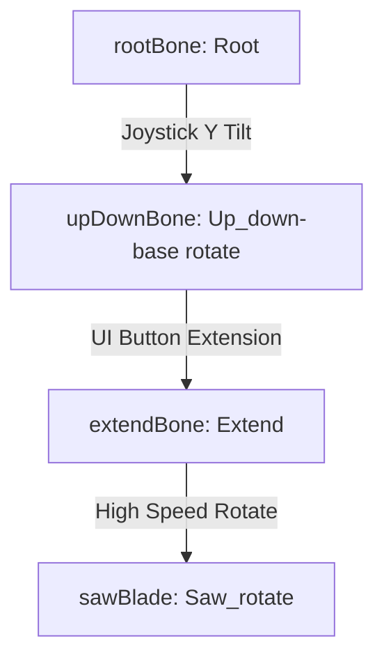

# Saw Arm Mechanics & Controller Analysis

This document provides a comprehensive analysis of the **Saw Arm Mechanism**, mapping the relationship between the rigged model [Saw_rigged.fbx](file:///C:/Users/User/Documents/GitHub/unity.coremechanism.deonphizzle/Assets/DeonPhizzle-/Saw%20Final/Saw_rigged.fbx) and the controller script [SawArmController.cs](file:///C:/Users/User/Documents/GitHub/unity.coremechanism.deonphizzle/Assets/Scripts/Saw/SawArmController.cs).

---

## 1. Rigged Model: `Saw_rigged.fbx`

The [Saw_rigged.fbx](file:///C:/Users/User/Documents/GitHub/unity.coremechanism.deonphizzle/Assets/DeonPhizzle-/Saw%20Final/Saw_rigged.fbx) model features a bone armature designed to allow multi-axis rotation, dynamic extension, and high-speed blade spinning.

### Hierarchy & Component Mapping
In the scene [StoneGenerator Scene.unity](file:///C:/Users/User/Documents/GitHub/unity.coremechanism.deonphizzle/Assets/ALL-SCENE-IS HERE/StoneGenerator Scene.unity#L46575-46624), the active model instance binds the following transforms:



| Field in Script | Bone Transform | Rig / Mechanical Role |
| :--- | :--- | :--- |
| **`rootBone`** | `Root` | Yaw Pivot: Rotates the arm assembly Left/Right based on Joystick X input. |
| **`upDownBone`** | `Up_down-base rotate` | Pitch Pivot: Tilts the arm assembly Up/Down on the configurable `tiltRotationAxis` (defaults to X-axis) based on Joystick Y input. |
| **`extendBone`** | `Extend` | Piston: Translates the saw blade Forward/Backward along `extendAxis` using UI Buttons. |
| **`sawBlade`** | `Saw_rotate` | Blade: Spins continuously around the local `spinAxis` to perform grinding and cutting. |

---

## 2. Controller Input & Arm Movement

The movement of the saw arm is controlled by combining a virtual joystick (for aiming) with UI buttons (for extension/retraction):

### A. Joystick Aiming (Yaw & Pitch with Axis Locking)
- **Axis Locking**: To prevent diagonal drift and ensure precise controls, the script compares the absolute values of `joyX` and `joyY`. Whichever axis has the larger input becomes the active axis, and the other is set to `0` (disabled) for that frame.
- **Yaw (Left/Right):** Driven by Joystick X. It rotates the `rootBone` using a configurable `rootRotationAxis` and clamps the angle between `minRootAngle` and `maxRootAngle` (default `-45` to `+45` degrees):
  ```csharp
  rootBone.localRotation = initialRootLocalRot * Quaternion.AngleAxis(currentRootAngle, rootRotationAxis.normalized);
  ```
- **Pitch (Up/Down):** Driven by Joystick Y. It tilts the `upDownBone` using a configurable `tiltRotationAxis` and clamps the relative angle between `minTiltZ` and `maxTiltZ` (default `-60` to `+60` degrees). The code subtracts `joyY` input to ensure forward joystick movement moves the saw upward, and backward movement moves it downward by default:
  ```csharp
  currentTiltZ -= joyY * tiltSpeed * Time.deltaTime;
  currentTiltZ = Mathf.Clamp(currentTiltZ, minTiltZ, maxTiltZ);
  upDownBone.localRotation = initialUpDownLocalRot * Quaternion.AngleAxis(currentTiltZ, tiltRotationAxis.normalized);
  ```

### B. Manual Piston Translation (Forward/Backward with Collision Blocking)
- UI buttons trigger forward/backward movement.
- **Linecast Blocking:** When moving forward, the script projects a `Physics.Linecast` ahead of the blade (`sawBlade`) by `moveStep + bladeRadius` using the configured `stoneLayer`. It uses the configurable `collisionCheckAxis` (if non-zero) or defaults to `extendAxis` to determine the world direction of movement:
- If blocked, `pathBlocked` becomes `true`, stopping translation and triggering the grinding visual/sound effects at the hit point.
- If not blocked, the `extendBone` translates:
  ```csharp
  extendBone.localPosition = initialExtendLocalPos + (extendAxis.normalized * currentExtension);
  ```
- Extension is clamped between `-maxBackwardDistance` and `maxForwardDistance`.

---

## 3. Cutting Mechanics: Grinding vs. Slicing

The controller supports two distinct phases of interaction with the stone layer:

### A. Grinding (Overlap & Linecast Impact Logic)
- **Shared Effects Routine:** Both the manual movement block (via linecast) and the static contact check (via overlap sphere) share the same unified method `ApplySawGrindEffects(...)`.
- When grinding is active, it:
  1. Plays the `sparksParticle` system oriented along the contact point normal.
  2. Plays the `waterEffectParticle` system.
  3. Loops the loopable `sawingSound`.
  4. Spawns visual dent decals (`sawCutMarkPrefab`) parented to the hit stone.
  5. Registers a single strike per play session on the [StoneGenerator](file:///C:/Users/User/Documents/GitHub/unity.coremechanism.deonphizzle/Assets/Scripts/Stone/StoneGenerator.cs#L5) using:
     ```csharp
     stoneGen.RegisterToolStrike();
     ```

### B. Slicing (EzySlice Mesh Splitting)
When [SliceStoneAtBladePosition](file:///C:/Users/User/Documents/GitHub/unity.coremechanism.deonphizzle/Assets/Scripts/Saw/SawArmController.cs#L260) is invoked (cooldown of `1.0f` second):
1. Calculates the slicing plane using the saw blade's current position and its rotated normal vector:
   ```csharp
   Vector3 planePoint = sawBlade.position;
   Vector3 planeNormal = sawBlade.TransformDirection(bladeCutNormal).normalized;
   ```
2. Invokes the `EzySlice` library to split the stone's 3D mesh:
   ```csharp
   SlicedHull hull = target.Slice(planePoint, planeNormal);
   ```
3. **Cross-Section Materials:** Evaluates whether it sliced a standard stone piece or a jade vein, applying the correct internal texture (`crossSectionMaterial` or `jadeCrossSectionMaterial`).
4. **Armature Settle Logic:** 
   - Compares the volume/bounds of the two sliced pieces.
   - The **larger** piece inherits the original stone transform and remains static in the scene.
   - The **smaller** piece is separated into a new temporary GameObject, given physical mass/forces (Rigidbody/convex MeshCollider), blown away to simulate debris falling away, and destroyed after 3 seconds.
5. **Hit Anchor Relocation:** Any [HitAnchor](file:///C:/Users/User/Documents/GitHub/unity.coremechanism.deonphizzle/Assets/Scripts/Stone/HitAnchor.cs#L3) scripts residing on the smaller discarded piece are automatically re-parented to the falling object so they are removed from the active play field.
