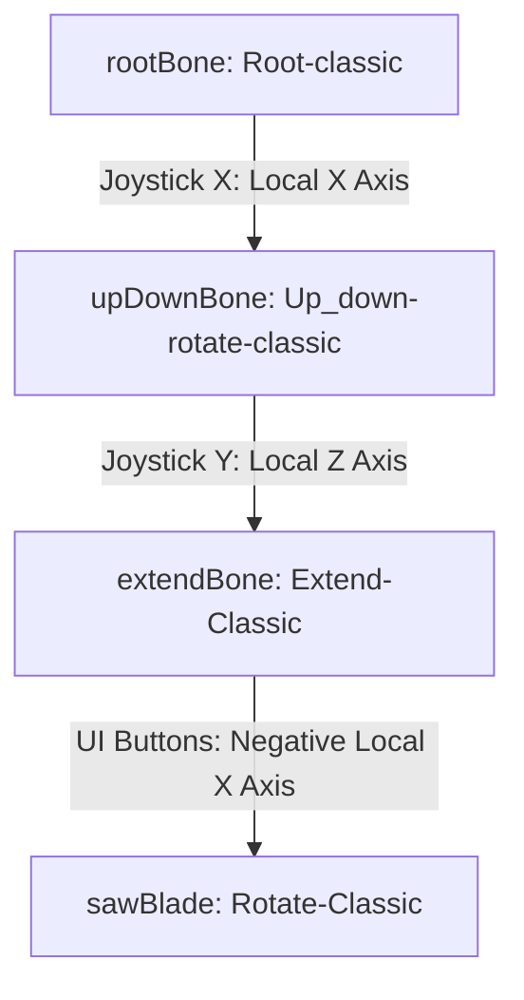
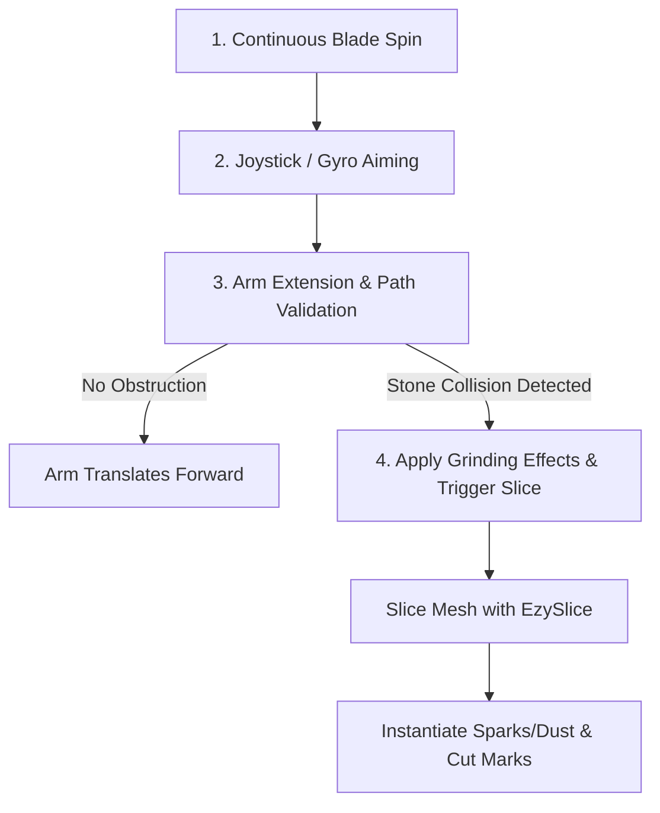
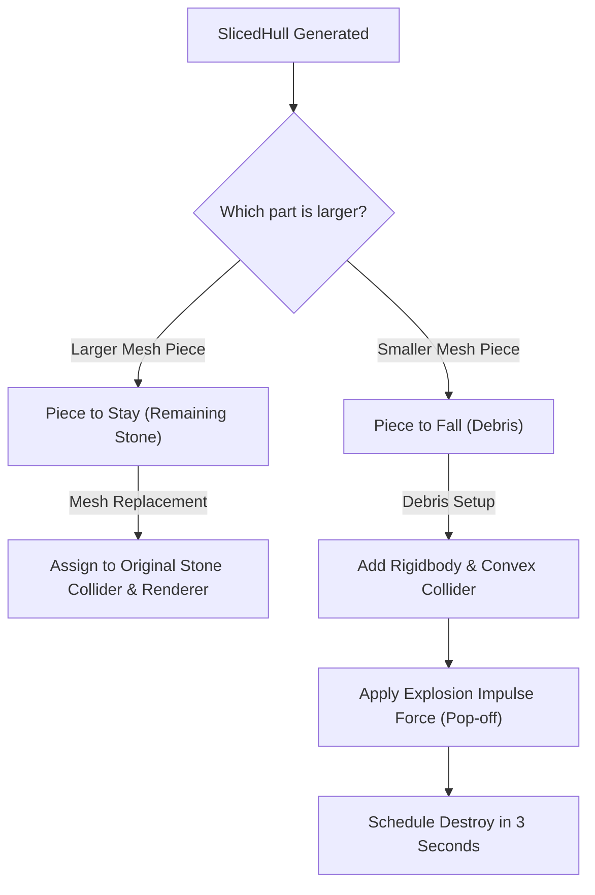

# 🪚 Classic Saw Cutting Mechanism Analysis

This document provides a technical breakdown of the `Saw_rigged -newclassic` model and its corresponding controller script, `ClassicSawController.cs`, inside the **Stone Cutting Classic Scene** (`StoneCuttingScene_Classic.unity`).

---

## ⚙️ 1. Bone Hierarchy & Armature Articulation

The `Saw_rigged -newclassic` model utilizes a joint-based armature to simulate a realistic industrial saw cutting arm:



### Skeletal Mapping Details
| Transform Bone | Hierarchy Node Name | Local Rotation Axis | Motion Type | Input Source |
| :--- | :--- | :--- | :--- | :--- |
| **`rootBone`** | `Root-classic` | Local X-Axis `(1, 0, 0)` | Left / Right Yaw | Virtual Joystick X / Gyro X |
| **`upDownBone`** | `Up_down-rotate-classic` | Local Z-Axis `(0, 0, 1)` | Up / Down Pitch | Virtual Joystick Y / Gyro Y |
| **`extendBone`** | `Extend-Classic` | Local -X Axis `(-1, 0, 0)` | Translation / Extension | UI Manual Buttons (Hold) |
| **`sawBlade`** | `Rotate-Classic` | Local Z-Axis `(0, 0, 1)` | Continuous Spin | Procedural `Update()` (Auto) |

---

## 🚀 2. Cutting Execution Pipeline

The stone cutting process is divided into real-time phases:



### Phase 1: Continuous Blade Spin
Every frame in `Update()`, if `sawBlade` is active, it rotates on its local `spinAxis` at a high velocity:
```csharp
sawBlade.Rotate(spinAxis.normalized * bladeSpinSpeed * Time.deltaTime, Space.Self);
```
* **Default Speed**: `1500f` degrees per second.
* **Default Spin Axis**: Local Z `(0, 0, 1)`.

### Phase 2: Analog Aiming (Joystick + Gyro)
The tool calculates aiming inputs by blending the **Virtual Joystick** vectors and calibrated **Gyro Accelerometer** values:
* **Yaw Angle (`currentRootAngle`)**: Accumulated from `joyX` (clamped between `-45°` and `45°`).
* **Pitch Angle (`currentTiltZ`)**: Accumulated from `joyY` (clamped between `-60°` and `60°`).
* **Smoothing**: Values are interpolated smoothly frame-by-frame and applied directly to local rotations using `Quaternion.AngleAxis` to avoid axis locks.

### Phase 3: Arm Extension & Collision Linecast
When the player holds down the **Forward Button**, the armature translates forward. To prevent the physical blade from clipping through the stone before a slice, the script runs a forward-facing `Linecast`:
* **Linecast Span**: From the center of the blade to the expected position plus the blade's radius (`startPos + direction * (moveStep + bladeRadius)`).
* **Layer Filtering**: Only checks for collisions on the `stoneLayer`.
* **Action**: If a hit is registered, extension stops (`pathBlocked = true`) and grinding/cutting is triggered at the hit contact point.

### Phase 4: Grind Effects & Real-Time Slicing
When in contact with the stone (via `Linecast` block or `Physics.OverlapSphere` collision), the controller:
1. **Sparks & Water Effects**: Triggers the `sparksParticle` and `waterEffectParticle` at the exact contact point.
2. **Audio Feedback**: Plays a continuous looping saw grind audio clip (`sawingSound`).
3. **Cut Marks / Dents**: Spawns a physical dent prefab (`sawCutMarkPrefab`) parented to the stone's transform every `0.1` seconds (`grindInterval`).
4. **Mesh Slicing**: Invokes the `SliceStoneAtBladePosition()` routine.

---

## ✂️ 3. Real-Time Mesh Slicing (EzySlice Integration)

Real-time slicing is handled dynamically by integrating the **EzySlice** library. The slice geometry is defined by a 3D slicing plane:

* **Slicing Plane Origin**: Center of the blade (`sawBlade.position`).
* **Slicing Plane Normal**: Blade's local `bladeCutNormal` transformed to world space:
  ```csharp
  Vector3 planeNormal = sawBlade.TransformDirection(bladeCutNormal).normalized;
  ```

### Mesh Re-generation & Split Logic:
Once `Slice()` executes, it generates a `SlicedHull` containing the upper and lower halves of the mesh. The controller divides them using volumetric bounding box sizes:



1. **The Remaining Stone (`pieceToStay`)**:
   * Replaces the original stone's `MeshFilter.sharedMesh` and `MeshCollider.sharedMesh` in-place.
   * Inherits the original materials and stays static, allowing the player to keep slicing it.
2. **The Falling Scrap (`pieceToFall`)**:
   * Instantiated as a new GameObject in the scene.
   * Gets a `Rigidbody` (mass = `15f`) and convex `MeshCollider`.
   * Pushed away using an explosion force to simulate falling off:
     ```csharp
     rb.AddExplosionForce(40f, originalPos + Vector3.up * 0.1f, 2f);
     ```
   * Set to layer `2` (Ignore Raycast) and automatically cleaned up in `3` seconds.
3. **Anchor Migration**:
   * Any active `HitAnchor` child elements on the split mesh are migrated to the falling debris if they lie on the discarded side of the slicing plane (calculated using a vector dot product against the plane normal).

---

> [!TIP]
> **Performance Optimization**: Mesh splitting can be computationally heavy. To prevent frame drops, the `sliceCooldown` is configured to `1.0f` second, preventing EzySlice from executing multiple mesh cuts in rapid succession on the same frame.
