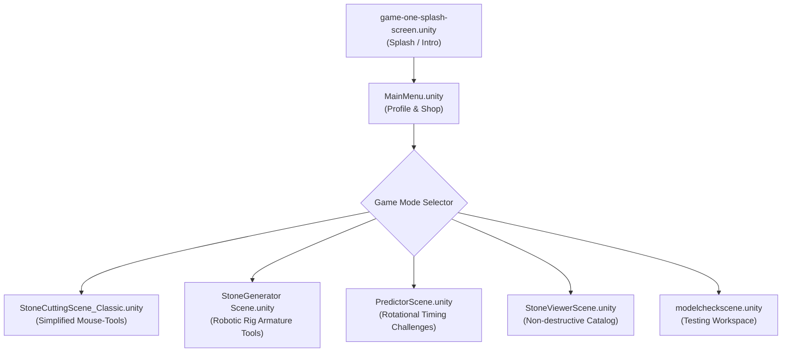

# Unity Jade Stone Cutting Core - Scene Index & Mechanics

This document provides a comprehensive mapping of all Unity scenes within the project, detailing their functionalities, active controller scripts, UI setups, and mechanics.

---

## 1. Project Scene Index

All game scenes are located in the [Assets/ALL-SCENE-IS HERE](file:///C:/Users/User/Documents/GitHub/unity.coremechanism.deonphizzle/Assets/ALL-SCENE-IS%20HERE) folder:

---

## 2. Detailed Scene Specifications

### A. Main Entry & Navigation

#### 1. `game-one-splash-screen.unity`
* **Purpose**: Serves as the introductory entry scene. Displays logo branding, licensing, and titles before loading the main menu.

#### 2. `MainMenu.unity`
* **Purpose**: The lobby and configuration hub.
* **Key Components**:
  * **User profile management**: Reads/writes user scores and profiles via [ProfileManager.cs](file:///C:/Users/User/Documents/GitHub/unity.coremechanism.deonphizzle/Assets/Scripts/MVC/Controllers/ProfileManager.cs) and [PlayerProfileUI.cs](file:///C:/Users/User/Documents/GitHub/unity.coremechanism.deonphizzle/Assets/Scripts/MVC/Views/PlayerProfileUI.cs).
  * **Stone Market Shop**: Allows browsing, purchasing, and unlocking raw stones based on point balances using [ShopManager.cs](file:///C:/Users/User/Documents/GitHub/unity.coremechanism.deonphizzle/Assets/Scripts/MVC/Views/ShopManager.cs) and [StoneMarketManager.cs](file:///C:/Users/User/Documents/GitHub/unity.coremechanism.deonphizzle/Assets/Scripts/MVC/Controllers/StoneMarketManager.cs).
  * **Leaderboards**: Displays top-performing player profiles using [LeaderboardManager.cs](file:///C:/Users/User/Documents/GitHub/unity.coremechanism.deonphizzle/Assets/Scripts/MVC/Controllers/LeaderboardManager.cs).

---

### B. Core Gameplay Scenes

#### 3. `StoneGenerator Scene.unity`
* **Purpose**: The primary gameplay scene demonstrating modern, high-precision robotic cutting operations.
* **Tool Setup**: Spawns and configures the active rigged joint armatures:
  * **Hammer**: [NewHammerController.cs](file:///C:/Users/User/Documents/GitHub/unity.coremechanism.deonphizzle/Assets/Scripts/Hammer/NewHammerController.cs) performing pure rotational strikes.
  * **Saw**: [SawArmController.cs](file:///C:/Users/User/Documents/GitHub/unity.coremechanism.deonphizzle/Assets/Scripts/Saw/SawArmController.cs) performing slicing cuts using `EzySlice`.
  * **Chisel**: [ManualChiselController.cs](file:///C:/Users/User/Documents/GitHub/unity.coremechanism.deonphizzle/Assets/Scripts/Chisel/ManualChiselController.cs) performing normal-aligned strikes.
* **Control Layout**: Displays dual Virtual Joysticks, tool activation/working status buttons, and the X-Ray Torch switch.

#### 4. `PredictorScene.unity`
* **Purpose**: Rhythmic timing challenge mode.
* **Mechanics**:
  * Loads `predictor_challenge_data` from JSON stone blueprints.
  * The stone is rotated automatically through sequential time-step patterns (e.g. rotate clockwise for 3 seconds, stop, rotate counter-clockwise).
  * The player must calculate and time their strikes to land on shifting anchor targets.

#### 5. `StoneCuttingScene_Classic.unity`
* **Purpose**: Legacy gameplay version.
* **Mechanics**:
  * Employs older, simplified tool configurations (e.g., [HammerController](file:///C:/Users/User/Documents/GitHub/unity.coremechanism.deonphizzle/Assets/Scripts/Hammer/HitController.cs) where the tool model follows the mouse cursor directly on-screen).
  * Lacks the complex 3-phase robotic armature rotations, relying on simpler trigger collisions instead.

---

### C. Inspection & Testing Utilities

#### 6. `StoneViewerScene.unity`
* **Purpose**: A gallery/catalog inspector.
* **Mechanics**:
  * Allows non-destructive examination of generated jade stones.
  * Shows exact metrics (mass, jade content, clarity grade, expected points) on a side-panel UI using [StonePropertySelector.cs](file:///C:/Users/User/Documents/GitHub/unity.coremechanism.deonphizzle/Assets/Scripts/MVC/Views/StonePropertySelector.cs).
  * No active time limits or strike constraints are enforced.

#### 7. `modelcheckscene.unity`
* **Purpose**: A clean developer sandbox scene for verifying mechanical arm rig alignments, verifying visual material lookups, and checking skeleton skin weights.
