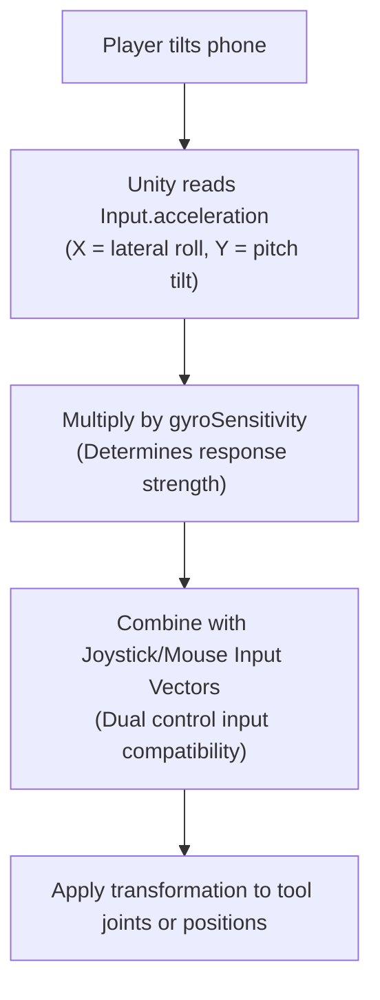

then# 🌀 Unified Gyroscope / Tilt ("Xyro") Controller Integration & Operation Guide

This document explains how the **Gyroscope / Tilt Control System** (referred to as the **"Xyro" Controller**) is integrated across all tools in the `unity.coremechanism.deonphizzle` codebase and how it functions for each specific tool.

---

## 🔍 1. Tool Compatibility & Capability Overview

### Can Gyro control all tools?
**Yes.** All tools that feature active, real-time manual aiming, joint rotations, or positional translation are fully compatible and now have Gyro controls implemented. 

Tools that use static animations on click (e.g., `TrimSawController` and `ChiselController`) do not use manual movement inputs, but all user-controlled tools utilize the Gyro system:

| Tool Category | Controller Class | File Link | Gyro Supported? | What it Controls |
| :--- | :--- | :--- | :---: | :--- |
| **Robotic Saw (Classic)** | `SawArmController` | [SawArmController.cs](file:///C:/Users/User/Documents/GitHub/unity.coremechanism.deonphizzle/Assets/Scripts/Saw/SawArmController.cs) | **Yes** | Root Bone Yaw & Hinge Bone Pitch |
| **Robotic Saw (Alternative)** | `ClassicSawController` | [ClassicSawController.cs](file:///C:/Users/User/Documents/GitHub/unity.coremechanism.deonphizzle/Assets/Scripts/Saw/ClassicSawController.cs) | **Yes** | Root Bone Yaw & Hinge Bone Pitch |
| **Translation Saw (Modern)** | `SawToolController` | [SawToolController.cs](file:///C:/Users/User/Documents/GitHub/unity.coremechanism.deonphizzle/Assets/Scripts/Saw/SawToolController.cs) | **Yes** | X-Z Lateral & Depth Translation |
| **Articulated Chisel (Classic)** | `ClassicChiselController` | [ClassicChiselController.cs](file:///C:/Users/User/Documents/GitHub/unity.coremechanism.deonphizzle/Assets/Scripts/Chisel/ClassicChiselController.cs) | **Yes** | Root Bone Yaw & Tilt Bone Pitch |
| **Articulated Chisel (Manual)** | `ManualChiselController` | [ManualChiselController.cs](file:///C:/Users/User/Documents/GitHub/unity.coremechanism.deonphizzle/Assets/Scripts/Chisel/ManualChiselController.cs) | **Yes** | Wrapper Yaw & Pitch Transforms |
| **Articulated Hammer (Classic)** | `NewHammerController` | [NewHammerController.cs](file:///C:/Users/User/Documents/GitHub/unity.coremechanism.deonphizzle/Assets/Scripts/Hammer/NewHammerController.cs) | **Yes** | Root Bone Yaw & Top Bone Pitch |
| **Translation Hammer (Modern)** | `HammerController` | [HitController.cs](file:///C:/Users/User/Documents/GitHub/unity.coremechanism.deonphizzle/Assets/Scripts/Hammer/HitController.cs) | **Yes** | X-Y Positional Screen Translation |
| **Articulated Dremel (Classic)** | `DremelToolController` | [DremelControlle.cs](file:///C:/Users/User/Documents/GitHub/unity.coremechanism.deonphizzle/Assets/Scripts/Dramel/DremelControlle.cs) | **Yes** | Root Bone Yaw & Up/Down Bone Pitch |
| **Mouse-Following Base** | `ToolController` | [ToolController.cs](file:///C:/Users/User/Documents/GitHub/unity.coremechanism.deonphizzle/Assets/Scripts/Tool/ToolController.cs) | **Yes** | X-Y Positional Screen Translation |

---

## 🕹️ 2. Core Physics: How Gyro Input Works

The Gyro/Tilt system maps the physical rotation/gravity vector of the player's mobile device to local movement vectors inside Unity using the following pipeline:



### The Input Formulas
1. **Raw Sensor Reading**:
   * **`Input.acceleration.x`**: Lateral tilt (steering left/right).
   * **`Input.acceleration.y`**: Vertical tilt (tilting up/down).
2. **Combination and Clamping**:
   ```csharp
   // 1. Check joystick input
   float inputX = joystick.InputVector.x;
   float inputY = joystick.InputVector.y;

   // 2. Add gyro input if enabled
   if (enableGyro)
   {
       inputX += Input.acceleration.x * gyroSensitivity;
       inputY += Input.acceleration.y * gyroSensitivity;
   }
   ```
3. **Control Translation**:
   The combined vectors are clamped within the standard bounds of the respective tool to prevent control glitching or boundary breakages.

---

## 🛠️ 3. Tool-by-Tool Detailed Mechanics

Here is the exact operation workflow of how the Gyroscope/Tilt controls affect each tool type:

### A. The Joint-Based / Robotic Tools
*Includes: `SawArmController`, `ClassicSawController`, `ClassicChiselController`, `ManualChiselController`, `NewHammerController`, `DremelToolController`*

These tools mimic heavy, mechanical joint armatures. Instead of shifting the entire tool body, tilting controls the individual bones/joints:

1. **Yaw (Horizontal steering)**: 
   * Shifting the phone left/right rotates the `rootBone` (or equivalent horizontal base hinge) around the defined `rootRotationAxis` (typically the local Y or X bone axis).
2. **Pitch (Vertical aiming)**: 
   * Tilting the phone forward/backward rotates the `upDownBone`/`tiltBone` (or equivalent vertical pivot) around the defined `tiltRotationAxis` (typically Z).
3. **Cardinal Axis Locking**:
   * For tools that feature cardinal locking (like `NewHammerController` and `SawArmController`), the dominant input axis is locked. Tilting heavily to the side locks out up/down rotation, ensuring pure horizontal sweeps.
4. **Return to Center**:
   * For the chisel controllers (`ClassicChiselController`), if the movement mode is set to `Return_To_Center`, releasing device tilt will cause the tool joints to spring back to center dynamically.

---

### B. The Translation-Based / Screen-Space Tools
*Includes: `SawToolController`, `ToolController`, `HammerController`*

These tools move their entire visual/physical model freely in space relative to the camera or mouse pointer:

1. **SawToolController (X-Z Translation)**:
   * **Tilt X** translates the saw body left and right along the camera's right vector.
   * **Tilt Y** translates the saw body forward and backward along the camera's forward vector.
   * This is ideal for slicing stones from front-to-back or side-to-side on mobile devices.
2. **ToolController & HammerController (X-Y Translation)**:
   * **Tilt X** and **Tilt Y** translate the tool body left/right/up/down in screen space.
   * Device tilt acts as an offset modifier relative to mouse/touch drag positions. The offset resets smoothly when inputs are released.

---

## ⚙️ 4. Code & Customization Interface

Every tool script exposes a unified properties inspector and sensitivity adjustment API method:

### Inspector Configuration
* **`enableGyro`** (bool): Toggles device accelerometer tilt checking.
* **`gyroSensitivity`** (float): Adjusts how responsive the tool is to physical tilt angles.

### Sensitivity Method API
Sliders in the settings UI can adjust sensitivity for any dynamic tool by invoking the method below:
```csharp
public void SetGyroSensitivityFromSlider(float sliderValue)
{
    gyroSensitivity = sliderValue;
}
```
* **Range recommendation**: `[0.5f, 5.0f]` (defined via inspector slider ranges for comfortable gameplay).
