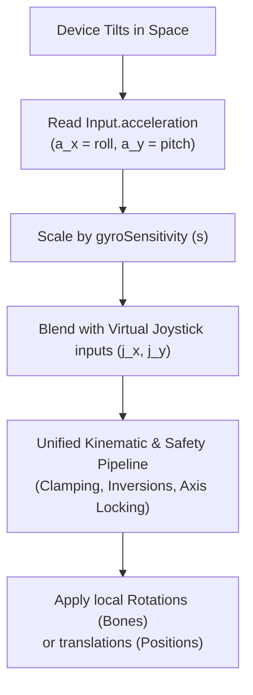

# Gyroscope ("Xyro") Control Subsystem Mechanics

This document provides a technical analysis of the **Gyroscope and Accelerometer Tilt Control System** (referred to as the **"Xyro" Subsystem**) implemented across the codebase. It details the sensor processing pipeline, mathematical formulas, and mapping paradigms used to control 3D bone armatures and positional translation.

---

## 1. System Overview & Sensor Pipeline

The Gyro control system translates the physical orientation and gravitational tilt of a mobile device into aiming, swivel, and movement inputs inside the game. Rather than implementing separate control routines for the gyroscope, the codebase overrides the core virtual joystick variables, allowing seamless input stacking.



---

## 2. Mathematical Blending Formulas

Every compatible tool controller aggregates input coordinates inside its `Update()` loop before applying motion. 

1. **Input Summation**:
   The primary input variables ($x_{\text{final}}$ and $y_{\text{final}}$) are calculated by scaling the accelerometer vector components by the sensitivity value and adding them to the raw virtual joystick vectors:
   $$x_{\text{final}} = x_{\text{joystick}} + \left(a_x \times s_{\text{gyro}}\right)$$
   $$y_{\text{final}} = y_{\text{joystick}} + \left(a_y \times s_{\text{gyro}}\right)$$
   *Where:*
   * $x_{\text{joystick}}, y_{\text{joystick}}$ are the raw values of the `VirtualJoystick` vector ($[-1.0, 1.0]$).
   * $a_x, a_y$ are the values of `Input.acceleration.x` (lateral roll) and `Input.acceleration.y` (vertical pitch).
   * $s_{\text{gyro}}$ is the multiplier defined by `gyroSensitivity` (default configurable range $[0.5, 5.0]$).

2. **Inversion and Axis Swapping**:
   Once summed, the variables undergo standard modifications like inversion or orientation swapping based on editor settings:
   $$\text{If } \text{invertHorizontal} \implies x_{\text{final}} = -x_{\text{final}}$$
   $$\text{If } \text{invertVertical} \implies y_{\text{final}} = -y_{\text{final}}$$
   $$\text{If } \text{swapAxes} \implies \text{Swap}(x_{\text{final}}, \ y_{\text{final}})$$

3. **Coordinate Locking & Clamping**:
   * For axis-locked controllers, the dominant axis determines movement, setting the other component to $0$.
   * For angular joints, the resulting values are integrated over time and clamped to the bone's rotational limits:
     $$\theta_{\text{aim}} = \text{Clamp}\left(\theta_{\text{aim}} + x_{\text{final}} \times \omega \times \Delta t, \ \theta_{\text{min}}, \ \theta_{\text{max}}\right)$$

---

## 3. Tool Mapping Paradigms

Depending on the mechanical configuration of the tool, the combined gyro/joystick inputs are mapped in one of two ways:

### A. Joint-Based (Kinematic Armature) Mappings
*   **Target Tools**: Robotic Saws, Articulated Chisels, Articulated Hammers, and Dremels.
*   **Behavior**: The input controls bone rotations. Shifting the device left or right swivels the base yaw joint (`rootBone`), while tilting it forward or backward hinges the arm pitch joint (`upDownBone` / `tiltBone`).
*   **Code Example (Pitch Modification)**:
    ```csharp
    if (upDownBone != null && Mathf.Abs(joyY) > 0.05f)
    {
        currentTiltZ -= joyY * tiltSpeed * Time.deltaTime;
        currentTiltZ = Mathf.Clamp(currentTiltZ, minTiltZ, maxTiltZ);
        upDownBone.localRotation = initialUpDownLocalRot * Quaternion.AngleAxis(currentTiltZ, tiltRotationAxis.normalized);
    }
    ```

### B. Translation-Based (Positional) Mappings
*   **Target Tools**: Translation Saws, Modern Hammers, and Mouse-Following Tool Bases.
*   **Behavior**: Shifting the device moves the entire 3D model relative to the scene workspace or screen.
*   **Translational Vector Generation (XZ Space)**:
    The lateral roll inputs translate the saw left/right relative to the camera's viewport, and pitch inputs translate it forward/backward:
    $$\mathbf{v}_{\text{translation}} = \left(\mathbf{v}_{\text{camRight}} \times x_{\text{final}} + \mathbf{v}_{\text{camForward}} \times y_{\text{final}}\right) \times \text{speed} \times \Delta t$$
    *Note: The vertical Y component of the camera reference vectors is stripped to ensure translational motion remains flat in the XZ horizontal plane.*

---

## 4. Subsystem Script Reference

| Class Name | File Link | Paradigm | Kinematic / Transform Role |
| :--- | :--- | :--- | :--- |
| **`ClassicChiselController`** | [ClassicChiselController.cs](file:///C:/Users/User/Documents/GitHub/unity.coremechanism.deonphizzle/Assets/Scripts/Chisel/ClassicChiselController.cs) | Joint-Based | Rotates chisel base yaw bone and wrist pitch bone. Supports spring-to-center. |
| **`ManualChiselController`** | [ManualChiselController.cs](file:///C:/Users/User/Documents/GitHub/unity.coremechanism.deonphizzle/Assets/Scripts/Chisel/ManualChiselController.cs) | Joint-Based | Rotates wrapper transforms representing yaw and pitch alignments. |
| **`DremelToolController`** | [DremelControlle.cs](file:///C:/Users/User/Documents/GitHub/unity.coremechanism.deonphizzle/Assets/Scripts/Dramel/DremelControlle.cs) | Joint-Based | Controls the articulated bones of the modern/classic dremel models. |
| **`NewHammerController`** | [NewHammerController.cs](file:///C:/Users/User/Documents/GitHub/unity.coremechanism.deonphizzle/Assets/Scripts/Hammer/NewHammerController.cs) | Joint-Based | Controls the swiveling and tilting armatures of the wrist hammer. |
| **`HitController`** | [HitController.cs](file:///C:/Users/User/Documents/GitHub/unity.coremechanism.deonphizzle/Assets/Scripts/Hammer/HitController.cs) | Translation | Adds gyro offsets to position translation in screen/world X-Y coordinates. |
| **`ClassicSawController`** | [ClassicSawController.cs](file:///C:/Users/User/Documents/GitHub/unity.coremechanism.deonphizzle/Assets/Scripts/Saw/ClassicSawController.cs) | Joint-Based | Drives the upgraded classic rigged saw armature. |
| **`SawArmController`** | [SawArmController.cs](file:///C:/Users/User/Documents/GitHub/unity.coremechanism.deonphizzle/Assets/Scripts/Saw/SawArmController.cs) | Joint-Based | Drives the modern rigged saw armature with axis-locking. |
| **`SawToolController`** | [SawToolController.cs](file:///C:/Users/User/Documents/GitHub/unity.coremechanism.deonphizzle/Assets/Scripts/Saw/SawToolController.cs) | Translation | Direct X-Z translation of the saw body, bounded within limits. |
| **`ToolController`** | [ToolController.cs](file:///C:/Users/User/Documents/GitHub/unity.coremechanism.deonphizzle/Assets/Scripts/Tool/ToolController.cs) | Translation | General screen-translation base offset controls. |

---

## 5. Architectural Benefits

*   **Code Reusability**: Compounding inputs onto `joyX` and `joyY` before downstream motion algorithms executes means that safety constraints (clamping limits, collision check raycasts) only need to be written once.
*   **Dual Control Mixing**: Allows players to use physical joysticks and tilting at the same time. Joystick provides coarse movement, and Gyro tilt provides fine adjustment.
*   **Runtime Calibration**: Sliders dynamically tweak sensitivity on active tools using:
    ```csharp
    public void SetGyroSensitivityFromSlider(float sliderValue)
    {
        gyroSensitivity = sliderValue;
    }
    ```
